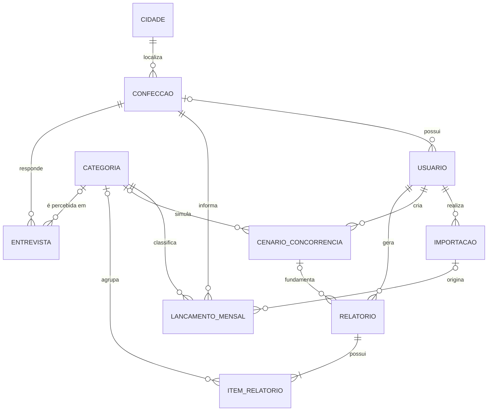
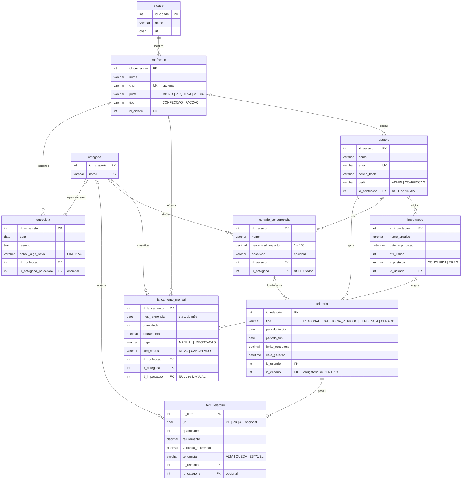

MySQL | RedeSulanca

# Banco de Dados

## Modelo conceitual

No modelo conceitual não aparecem chaves estrangeiras: elas surgem como colunas só no modelo lógico.



### Entidades e atributos

| Entidade | Identificador | Demais atributos |
|---|---|---|
| **Cidade** | id_cidade | nome, uf |
| **Confecção** | id_confeccao | nome, cnpj (opcional), porte (micro, pequena, média), tipo (confecção, facção) |
| **Usuário** | id_usuario | nome, email, senha_hash, perfil (ADMIN, CONFECCAO) |
| **Categoria** | id_categoria | nome |
| **Lançamento mensal** | id_lancamento | mes_referencia, quantidade, faturamento, origem (MANUAL, IMPORTACAO), status (ATIVO, CANCELADO) |
| **Importação** | id_importacao | nome_arquivo, data_importacao, qtd_linhas, status (CONCLUIDA, ERRO) |
| **Cenário de concorrência** | id_cenario | nome, percentual_impacto, descricao (opcional) |
| **Entrevista** | id_entrevista | data, resumo, achou_algo_novo (sim, não) |
| **Relatório** | id_relatorio | tipo (REGIONAL, CATEGORIA_PERIODO, TENDENCIA, CENARIO), periodo_inicio, periodo_fim, limiar_tendencia, data_geracao |
| **Item de relatório** | id_item | uf (opcional), quantidade, faturamento, variacao_percentual, tendencia (ALTA, QUEDA, ESTAVEL) |

## Modelo lógico



**Legenda da cardinalidade:** `||` = exatamente 1 · `|o` = 0 ou 1 · `o{` = 0 ou N · `|{` = 1 ou N

## Relacionamentos e cardinalidades

| Entidade A | Relacionamento | Entidade B |
|---|---|---|
| Cidade (0,N) | localiza | Confecção (1,1) |
| Confecção (0,N) | possui | Usuário (0,1) |
| Confecção (0,N) | informa | Lançamento mensal (1,1) |
| Categoria (0,N) | classifica | Lançamento mensal (1,1) |
| Importação (0,N) | origina | Lançamento mensal (0,1) |
| Usuário (0,N) | realiza | Importação (1,1) |
| Usuário (0,N) | cria | Cenário de concorrência (1,1) |
| Usuário (0,N) | gera | Relatório (1,1) |
| Categoria (0,N) | simula | Cenário de concorrência (0,1) |
| Cenário de concorrência (0,N) | fundamenta | Relatório (0,1) |
| Relatório (1,N) | possui | Item de relatório (1,1) |
| Categoria (0,N) | agrupa | Item de relatório (0,1) |
| Confecção (0,N) | responde | Entrevista (1,1) |
| Categoria (0,N) | é percebida em | Entrevista (0,1) |

### Justificativa das cardinalidades opcionais

Cada participação (0,1) do modelo existe por causa de uma regra do minimundo:

| Relacionamento | Por que é (0,1) | Regra | Garantia no banco |
|---|---|---|---|
| Confecção → Usuário | O ADMIN não pertence a nenhuma confecção | 2 | `id_confeccao` aceita NULL; perfil validado pelo sistema |
| Importação → Lançamento mensal | O lançamento pode ser digitado à mão (origem MANUAL) | 4 | `id_importacao` aceita NULL; `origem` guarda MANUAL ou IMPORTACAO |
| Categoria → Cenário de concorrência | Um cenário sem categoria vale para todas | 6 | FK aceita NULL |
| Cenário de concorrência → Relatório | Só o relatório do tipo CENARIO usa cenário | 7 | `id_cenario` aceita NULL; tipo validado pelo sistema |
| Categoria → Item de relatório | O relatório REGIONAL agrupa por UF, não por categoria | 7 | `id_categoria` aceita NULL; UF ou categoria validado pelo sistema |
| Categoria → Entrevista | O empresário pode não saber ou não responder qual categoria vende mais | 9 | FK aceita NULL |

**Relatório (1,N) → Item de relatório:** a exigência de pelo menos um item não pode ser garantida por FK, porque o relatório é gravado antes dos itens. Quem garante é a transação de geração do relatório (`transacoes.sql`): se nenhum item for gerado, ela faz `ROLLBACK`.

## Chaves estrangeiras (modelo lógico)

Em um relacionamento 1:N, a FK fica no lado N. Se a cardinalidade desse lado é (1,1), a FK é `NOT NULL`; se é (0,1), ela aceita `NULL`.

| Tabela (lado N) | FK | Referencia | Obrigatória? |
|---|---|---|---|
| confeccao | id_cidade | cidade | Sim |
| usuario | id_confeccao | confeccao | Não (só para perfil CONFECCAO) |
| lancamento_mensal | id_confeccao | confeccao | Sim |
| lancamento_mensal | id_categoria | categoria | Sim |
| lancamento_mensal | id_importacao | importacao | Não (só para origem IMPORTACAO) |
| importacao | id_usuario | usuario | Sim |
| cenario_concorrencia | id_usuario | usuario | Sim |
| cenario_concorrencia | id_categoria | categoria | Não |
| relatorio | id_usuario | usuario | Sim |
| relatorio | id_cenario | cenario_concorrencia | Não (só para tipo CENARIO) |
| item_relatorio | id_relatorio | relatorio | Sim |
| item_relatorio | id_categoria | categoria | Não |
| entrevista | id_confeccao | confeccao | Sim |
| entrevista | id_categoria_percebida | categoria | Não |

## Regras do minimundo e onde são garantidas

| # | Regra | Implementação |
|---|---|---|
| 1 | Cada confecção fica em uma única cidade; CNPJ opcional | `id_cidade NOT NULL`, `cnpj` aceita NULL |
| 2 | ADMIN não tem confecção; CONFECCAO tem exatamente uma | `id_confeccao` opcional; combinação validada pelo sistema |
| 3 | Um lançamento por confecção, categoria e mês | `UNIQUE (id_confeccao, id_categoria, mes_referencia)` |
| 4 | Lançamento cancelado fica fora dos indicadores e relatórios | Views filtram `lanc_status = 'ATIVO'` |
| 5 | Linha inválida na planilha: nada da importação é gravado | Transação em `transacoes.sql` |
| 6 | Impacto entre 0 e 100; cenário sem categoria vale para todas | `id_categoria` opcional; faixa 0–100 validada pelo sistema |
| 7 | Relatório CENARIO exige cenário; regionais usam PE, PB ou AL | UF (PE, PB ou AL) e cenário obrigatório validados pelo sistema |
| 8 | Tendência pela variação comparada ao limiar | Calculada ao gerar o relatório |
| 9 | Entrevista registra a categoria que o empresário *acha* que mais vende | `id_categoria_percebida` |

## Arquivos

| Arquivo | Conteúdo |
|---|---|
| [schema.sql](schema.sql) | Criação do banco e das 10 tabelas |

## Como executar

O `schema.sql` já cria o banco `confeccoes`:

```bash
mysql -u root -p < schema.sql
```

Pelo **MySQL Workbench**: abra o arquivo em *File → Open SQL Script* e execute (⚡).